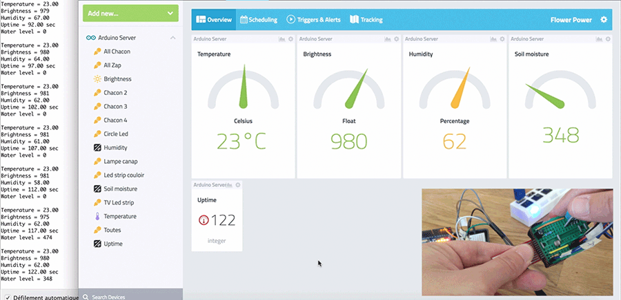

# Summary

- **Tuto 1**: [How to control two RGB LED strips ?](TP1_Two_RGB_LED_strips)
- **Tuto 2**: [How to control RGB LED strip with IR remote ?](TP2_IR_RGB_LED_strip)
- **Tuto 3**: [How to decode 433MHz RF remote codes ?](TP3_433MHz_Receiver)
- **Tuto 4**: [How to send 433MHz RF codes to power outlets ?](TP4_433MHz_Transmitter)
- **Tuto 5**: [How to make a simple dashboard for your 433Mhz power outlets ?](TP5_433MHz_Dashboard)
- **Tuto 6**: [How to control 2 LED strips + send 433MHz RF codes with Cayenne ?](TP6_RGB_LED_strips_433MHz_Cayenne)
- **Tuto 7**: [How to make a Flower Power like to your plants ?](TP7_FlowerPower)
- **[YouTube playlist](https://www.youtube.com/playlist?list=PLCeQOPohmBQLv9OxJ1JZnUnjsFsE_4C2X)**
  
# Tuto 1: How to control two RGB LED strips ?

## Demo

How to control two RGB LED strips with an Arduino and show results in Arduino IDE serial monitor.

    
## Requirements
- 1 Arduino UNO
- 2 x ULN2803
- 2 RGB 5050 LED strips
- 2 RGB LED strip connectors
- 1 12V external power supply
- Jumpers / Breadboard

## Code

[Readme & source code here](TP1_Two_RGB_LED_strips)

---------

# Tuto 2: How to control RGB LED strip with IR remote ?

## Demo

How to decode IR remote and control RGB LED strip.

## Requirements
- 1 Arduino UNO
- 1 IR receiver
- 1 IR remote
- 1 ULN2803
- 1 9V external power supply
- Jumpers / Breadboard

## Code

[Readme & source code here](TP2_IR_RGB_LED_strip)

---------

# Tuto 3: How to decode 433MHz RF remote codes ?

## Demo

Example for receiving 433MHz codes from Chacon & Zap remotes using rc-switch library.

## Requirements
- 1 Arduino UNO
- 1 433MHz receiver
- 1 433MHz remote
- Jumpers / Breadboard

## Code

[Readme & source code here](TP3_433MHz_Receiver)

---------

# Tuto 4: How to send 433MHz RF codes to power outlets ?

## Demo

Example for sending code from Arduino to Chacon power outlets.

## Requirements
- 1 Arduino UNO
- 1 433MHz transmitter
- Jumpers / Breadboard

## Code

[Readme & source code here](TP4_433MHz_Transmitter)

---------

# Tuto 5: How to make a simple dashboard for your 433Mhz power outlets ?

## Demo

Example for turning on / off Chacon & Zap power outlet with Cayenne dashboard

## Requirements
- 1 Arduino UNO
- 1 433MHz transmitter
- Jumpers / Breadboard

## Code

[Readme & source code here](TP5_433MHz_Dashboard)

---------

# Tuto 6: How to control 2 LED strips + send 433MHz RF codes with Cayenne ?

## Demo

How to control 2 RGB LED strips + turn on / off 433MHz power outlet with Cayenne dashboard

## Requirements

- 2 RGB 5050 LED strips
- 2 RGB 5050 LED strips connectors
- 2 ULN2803
- 1 433MHz transmitter
- 1 Arduino Ethernet shield or Wemos D1 Wifi or esp8266 module
- 1 9V / 12V external power supply
- N Wago connectors
- N 433MHz power outlet (Chacon & Zap)
- Jumpers / Breadboard

## Code

[Readme & source code here](TP6_RGB_LED_strips_433MHz_Cayenne)

---------

# Tuto 7: How to make a Flower Power like to your plants ?

## Demo

This [Flower Power](http://global.parrot.com/au/products/flower-power/) hack monitors and analyzes the four parameters essential to your plant's health into Cayenne dashboard.

4 in 1 Flower Power : Temperature + Brightness + Soil moisture + Humidity

## Requirements

  - 1 LED
  - 1 Photoresistor (for brightness)
  - 1 DHT11 (for temperature + humidity)
  - 1 Water sensor (for soil moisture)
  - 1 Arduino UNO
  - 1 Ethernet shield
  - 2 Resistors
  - 1 9V external power supply
  - Jumpers / Breadboards

## Code

[Readme & source code here](TP7_FlowerPower)

---------

# Videos

- [YouTube playlist](https://www.youtube.com/playlist?list=PLCeQOPohmBQLv9OxJ1JZnUnjsFsE_4C2X)

- **Tuto 1**: [How to control two RGB LED strips ?](https://www.youtube.com/watch?v=r9Jx8079knY)

- **Tuto 2**: [How to control RGB LED strip with IR remote ?](https://www.youtube.com/watch?v=6osMbB5GiOw)

- **Tuto 3**: [How to decode 433MHz RF remote codes ?](https://www.youtube.com/watch?v=6-827A7Ncaw)

- **Tuto 4**: [How to send 433MHz RF codes to power outlets ?](https://www.youtube.com/watch?v=LC9KjKzs1DM)

- **Tuto 5**: [How to make a simple dashboard for your 433Mhz power outlets ?](https://www.youtube.com/watch?v=9xBKRz43rQ4)

- **Tuto 7**: [How to make a Flower Power like to your plants ?](https://www.youtube.com/watch?v=DpATZUCZu0Q)

