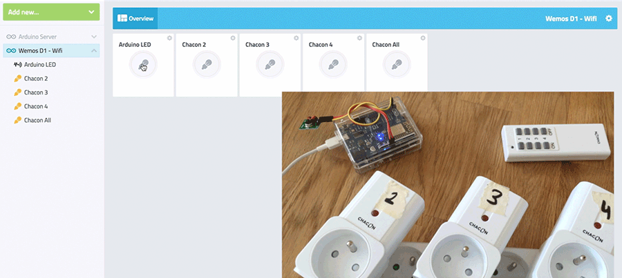

# Tuto 5: How to make a simple dashboard for your 433Mhz power outlets ?

## Demo

Example for turning on / off Chacon & Zap power outlet with Cayenne dashboard



## Requirements
- 1 Arduino UNO
- 1 433MHz transmitter
- Jumpers / Breadboard

## Wiring

| Transmitter | Arduino   | Wemos D1
|-------------|-----------|----------
| VCC         | 5V        | 5V
| GND         | GND       | GND
| DATA        | D10       | D1

## Configuration

Please get your personal remote codes from [TP3 433MHz Receiver](../TP3_433MHz_Receiver) and add them to "Chacon power outlet codes" section.
  
```
/!\ Please get your personal remote codes from TP3_433MHz_Receiver.
/!\ Please insert your custom Token (Your Cayenne account).
/!\ Please insert your custom SSID + Password (Your wifi credentials).
```

Update this line with your custom values

```c
char token[] = "XXXXXXXXXXXXXXXX";   // /!\ Enter your Cayenne token here
char ssid[] = "XXXXXXXXXXXXXXXXX";   // /!\ Enter your Wifi name here
char password[] = "XXXXXXXXXXXXX";   // /!\ Enter your Wifi password here

char chacon2_on[]  = "XXXXXXXXXXXXX";
char chacon3_on[]  = "XXXXXXXXXXXXX";
char chacon4_on[]  = "XXXXXXXXXXXXX";
char chacon2_off[] = "XXXXXXXXXXXXX";
char chacon3_off[] = "XXXXXXXXXXXXX";
char chacon4_off[] = "XXXXXXXXXXXXX";
```

and create this virtal pins in your Cayenne dashboard

```c
#define VIRTUAL_PIN_0 V0 // Virtual pin to led 13 for debug
#define VIRTUAL_PIN_5 V5 // Virtual pin to manage Chacon 2
#define VIRTUAL_PIN_6 V6 // Virtual pin to manage Chacon 3
#define VIRTUAL_PIN_7 V7 // Virtual pin to manage Chacon 4
#define VIRTUAL_PIN_8 V8 // Virtual pin to manage all Chacon power outlet
```
